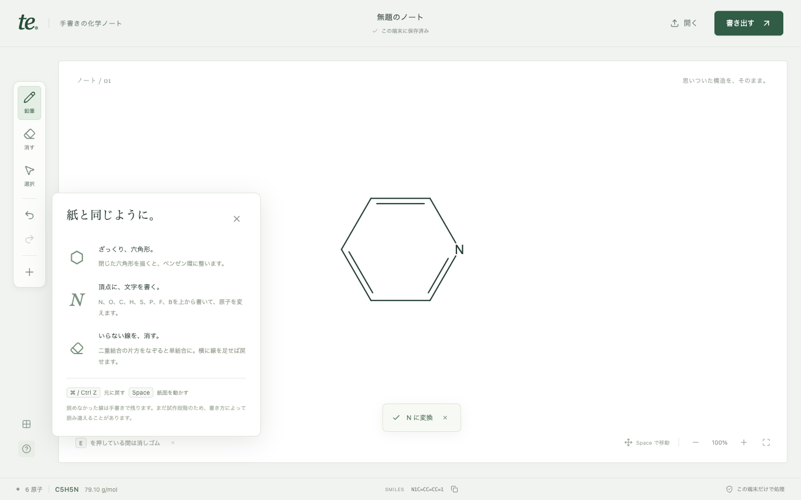
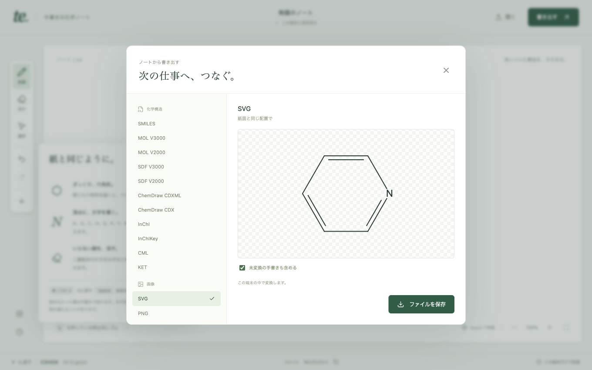

# 初版の実装状況

更新: 2026-09-06。初版の実装計画 Task 1–6 に対応する記録。元の要求である「ChemDrawの全出力形式」は継続事項であり、初版での達成を意味しない。

**追記:** ユーザーの実使用で不足が確認された自動整形と原子価補正を、[修正記録](chemical-editing-correction.md)のとおり実装した。以下の78件という件数は初版時点の記録であり、最新の実装・検証は修正記録を参照。

## 動作する機能

| 操作 | 実装と確認内容 |
|---|---|
| 六角形を描く | 原筆跡を表示し、入力終了後にベンゼンへ変換。回転、順方向・逆方向、頂点・辺からの描き始め、軽い揺れを18通りの合成筆跡で確認 |
| 原子へNを書く | 頂点の原子IDと結合を維持して元素を変更。一筆と、間隔を空けた三筆のNを実ブラウザで確認。O/C/H/S/P/F/Bのテンプレートも実装 |
| 消しゴムで消す | 二重結合の片線を消すと単結合になる。3本消してC6H12となり、描き足してC6H6に戻ることを実WASMで確認 |
| 上書きと移動 | 線の追記、原子の移動、選択による元素・電荷の補助変更。入力グループを確定してから道具を切り替える |
| Undo / Redo | 編集スナップショットによる最大100段のUndo。複数筆跡Nの変換も1回で戻る |
| 手書きを残す | 未認識の線は筆跡として残す。画像とネイティブJSONへ含められる |
| 保存と再読込 | localStorageへの1文書自動保存と `.te.json`。描画終了直後のCmd/Ctrl+Sにも最後の線が入る。破損・容量不足・別タブ競合を表示 |
| 化学形式 | SMILES、MOL/SDF V2000/V3000、CDX、CDXML、InChI、InChIKey、CML、KET。実Indigo WASMで変換。画像用SVG/PNG/JPEGとノートJSONも保存可能 |
| 化学情報 | 分子式、分子量、SMILESを画面下に表示。立体・同位体・水素・電荷を描画と出力で保持 |
| オフライン | 本番アセットとWorker/WASMをService Workerに保存。初回インストール完了後、通信を切って再読込し、描画・変換・CDX保存が可能 |

## 検証

実行環境: macOS、Node 25.9.0、インストール済みGoogle Chrome。テスト中の化学計算はモックではなくIndigo WASM 1.46.0を使用した。

- `npm test`: **54件成功**。化学処理・Worker 35件、編集コア9件、描画7件、ネイティブ文書3件。
- `npm run build`: **成功**。TypeScriptチェックと本番バンドル生成。
- `npx playwright test --config playwright.production.config.ts`: **1件成功**。オフライン再読込後の描画、分子式、SMILES、CDXバイナリ署名、ダウンロード、外部リクエスト0件を確認。
- 1360×850の本番画面で実マウス操作し、下記の紙面と出力プレビューを目視確認。コンソールのエラー・警告は0件。
- 編集と化学境界を独立レビューし、重要な指摘を修正後に再レビュー済み。

`npm run test:browser`: **23件成功（51.7秒）**。編集8シナリオに加え、15形式をそれぞれ独立したブラウザコンテキストからダウンロードし、化学形式の識別内容、CDX/PNG/JPEGのバイナリ署名、SVG、ノートJSONを確認した。単体・ブラウザ・オフラインの合計は**78件成功**。

保存テストを最初に一つのページから15回連続で実行すると11回目のダウンロードイベントが発生せず停止した。KET単独保存は成功したため、最終テストは形式ごとに独立したコンテキストへ分割した。これは各形式の保存確認であり、15ファイルの一括保存機能を検証したものではない。





## 修正した重要な不具合

- 六角形を辺の途中から描き始めた際、開始点を余分な頂点として7員環にする問題。
- 三筆のNを二筆の時点で確定し、三筆目が余分な結合になる問題。
- 素早く離れた位置に描く、描画直後に道具を切り替える、すぐに保存する際の筆跡消失。
- キーボードのP/V切替後、旧筆跡の再解釈で移動した原子が元へ戻る問題。
- ダイアログ表示中にUndoが背面の構造を変更する問題。
- 独立した原子が消せず、見えない炭素として残る問題。
- 絶対立体が相対立体へ変わる化学変換、未対応mapping/aliasが黙って落ちる問題。
- オフライン時に、静的アセットのVaryヘッダーで保存済みキャッシュに一致しない問題。

## 未達と次の作業

1. **筆者の個人差を含む認識精度・速度**: 合成筆跡と決まった操作の回帰確認が完了した段階。多数の筆者による正解率、誤確定率、p95遅延、FPSは未測定。[評価仕様](../planning/recognition-evaluation.md)に従い、実データで認識器の改良を判断する。
2. **全ChemDraw出力形式**: GIF/BMP/TIFF/EPS、反応・配列・旧形式・3D・OLE等は未達。[形式対応表](../planning/format-compatibility.md)に、前提条件と完了条件を記録した。
3. **ChemDraw実機との互換性**: 分子形式のIndigo往復は確認済み。ChemDrawで開いて再保存する外部検証は未実施。
4. **文書モデルの拡張**: 反応、配列、S-group、mapping、query、radical、相対／混合立体、複数SDFレコードは未対応。現状のモデルで意味を保存できない入力は拒否する。
5. **実ブラウザと保存の範囲**: Chromeで検証。Safari/Firefox、ブラウザプロセスを完全終了した後の永続キャッシュ復元、長期・多数文書の保存は未検証。現状のオフライン試験はインストール済みコンテキストでの再読込である。

## 起動

```sh
npm ci
npm run build
npm run preview
```

本番プレビュー: `http://127.0.0.1:4173/`。開発: `npm run dev`、`http://127.0.0.1:5173/`。

実行時に外部推論APIやCDNは利用しない。WASMを含む初回配信の取得と、依存パッケージのインストールには通信が必要。Web公開は行っていない。
